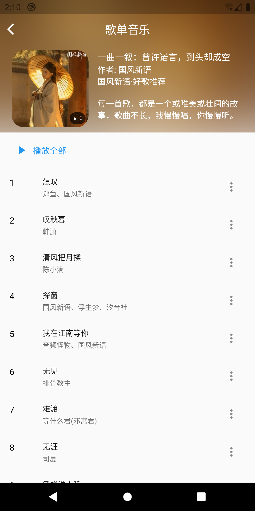
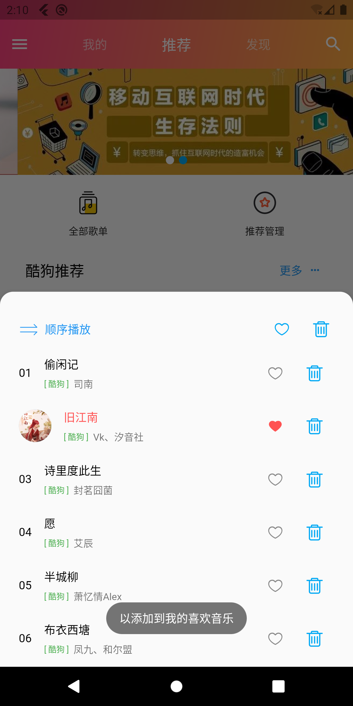
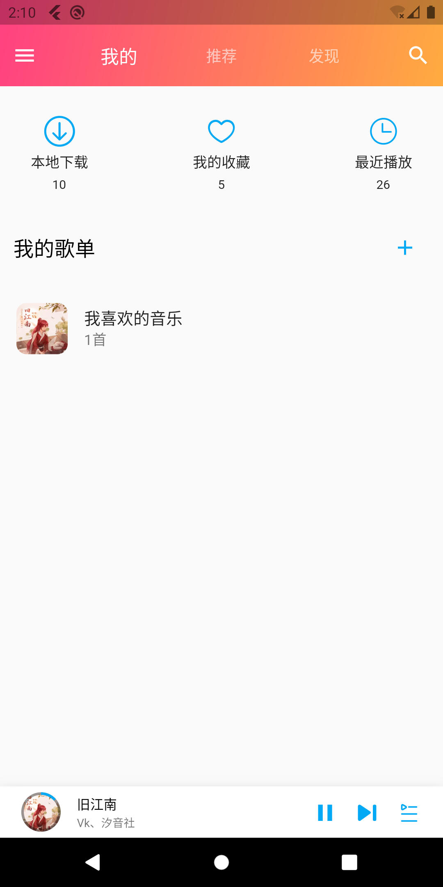
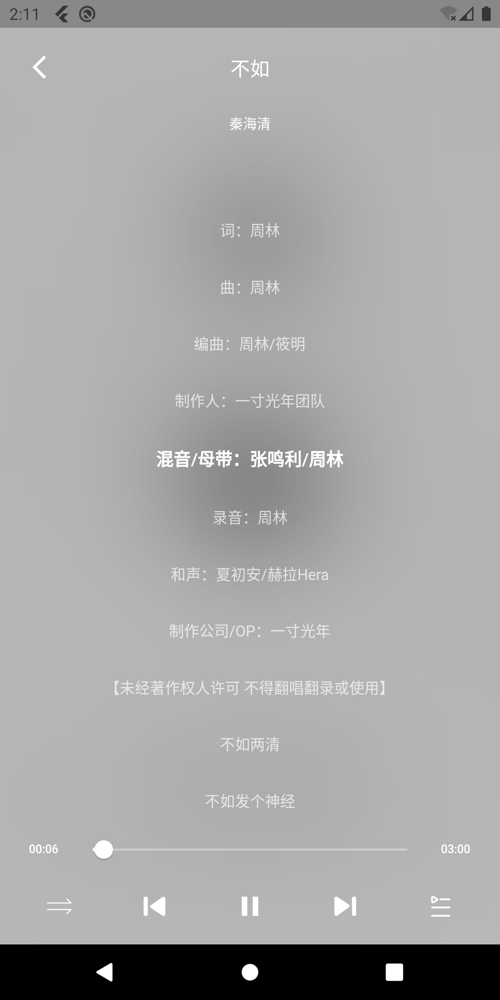
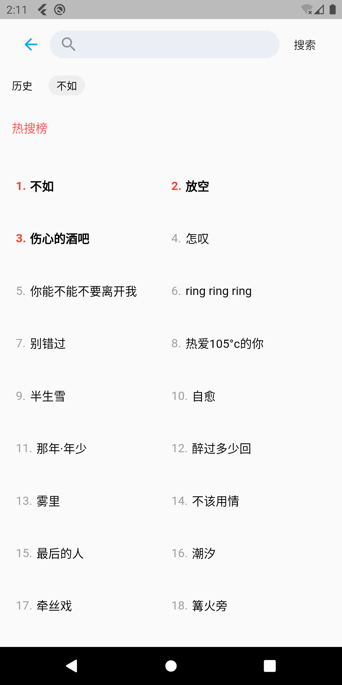
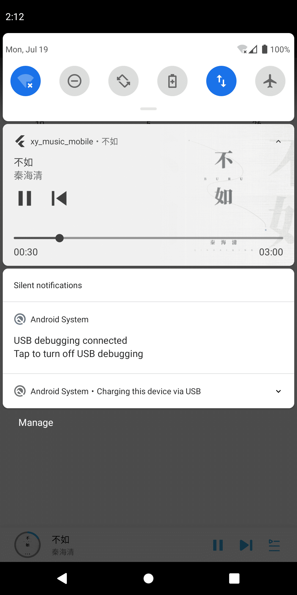

# XY音乐助手

> 项目名:  xy-music-mobile
>
> 目前项目起步阶段 开发中....

### 简介

基于Flutter框架开发的音乐播放软件，使用本音乐平台可进行全网音乐源搜索、播放、收藏、下载（暂未实现）、歌词展示、歌单服务、等便捷舒服的完美听歌体验。

支持平台：

1. **Android** ✅
2. **IOS** ✅

### 演示截图

|  |  |  |
| ------------------------------------------------------------ | ------------------------------------------------------------ | ------------------------------------------------------------ |
|  |  |  |
|  |  |                                                              |
|                                                              |                                                              |                                                              |

## 历史与当下

### 1. 第一版目标:    (已完成-2021-07-19)
1. 适配Android
2. 适配IOS
3. 能进行搜索听歌
4. 显示歌词
5. 添加播放列表

### 2. 第二版目标
1. 歌单开发与优化
2. 排行榜发现Tab功能栏
3. 音乐下载
4. 音乐播放优化

**PS: 如果您有能力欢迎加入开发提出Pull Request 或直接私信下方邮件联系我,如果您的贡献被采纳将会榜上有名！**

**开发者帮助指南Wiki：**

**https://github.com/cpyczd/xy-music-mobile/wiki/Pr-%E5%BC%80%E5%8F%91%E8%80%85%E5%B8%AE%E5%8A%A9%E6%8C%87%E5%8D%97**

### 项目协议

本项目基于 [Apache License 2.0](https://github.com/cpyczd/xy-music-mobile/blob/dev/LICENSE) 许可证发行，以下协议是对于 Apache License 2.0 的补充，如有冲突，以以下协议为准。

词语约定：本协议中的“本项目”指XY音乐播放项目；“使用者”指签署本协议的使用者；“官方音乐平台”指对本项目内置的包括酷我、酷狗、咪咕等音乐源的官方平台统称；“版权数据”指包括但不限于图像、音频、名字等在内的他人拥有所属版权的数据。

1. 本项目的数据来源原理是从各官方音乐平台的公开服务器中拉取数据，经过对数据简单地筛选与合并后进行展示，因此本项目不对数据的准确性负责。
2. 使用本项目的过程中可能会产生版权数据，对于这些版权数据，本项目不拥有它们的所有权，为了避免造成侵权，使用者务必在**24小时**内清除使用本项目的过程中所产生的版权数据。
3. 本项目内的官方音乐平台别名为本项目内对官方音乐平台的一个称呼，不包含恶意，如果官方音乐平台觉得不妥，可联系本项目更改或移除。
4. 本项目内使用的部分包括但不限于字体、图片等资源来源于互联网，如果出现侵权可联系本项目移除。
5. 由于使用本项目产生的包括由于本协议或由于使用或无法使用本项目而引起的任何性质的任何直接、间接、特殊、偶然或结果性损害（包括但不限于因商誉损失、停工、计算机故障或故障引起的损害赔偿，或任何及所有其他商业损害或损失）由使用者负责。
6. 本项目完全免费，且开源发布于 GitHub 面向全世界人用作对技术的学习交流，本项目不对项目内的技术可能存在违反当地法律法规的行为作保证，**禁止在违反当地法律法规的情况下使用本项目**，对于使用者在明知或不知当地法律法规不允许的情况下使用本项目所造成的任何违法违规行为由使用者承担，本项目不承担由此造成的任何直接、间接、特殊、偶然或结果性责任。

若你使用了本项目，将代表你接受以上协议。

音乐平台不易，请尊重版权，支持正版。 
若对此有疑问请 mail to: yustart+foxmail.com (请将`+`替换成`@`)